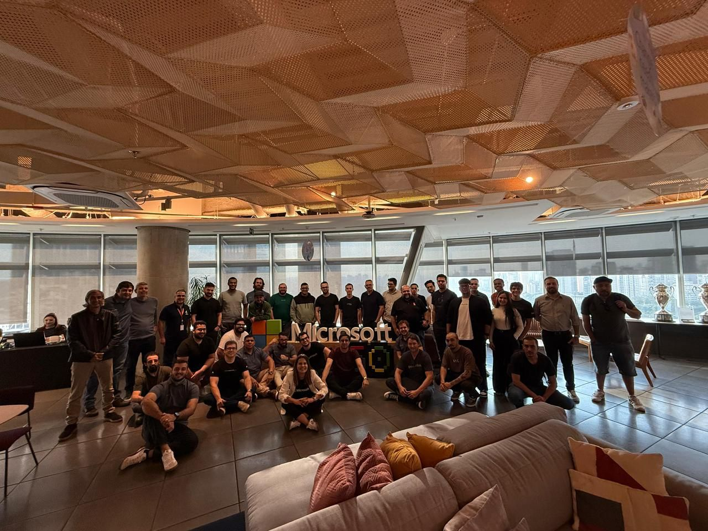
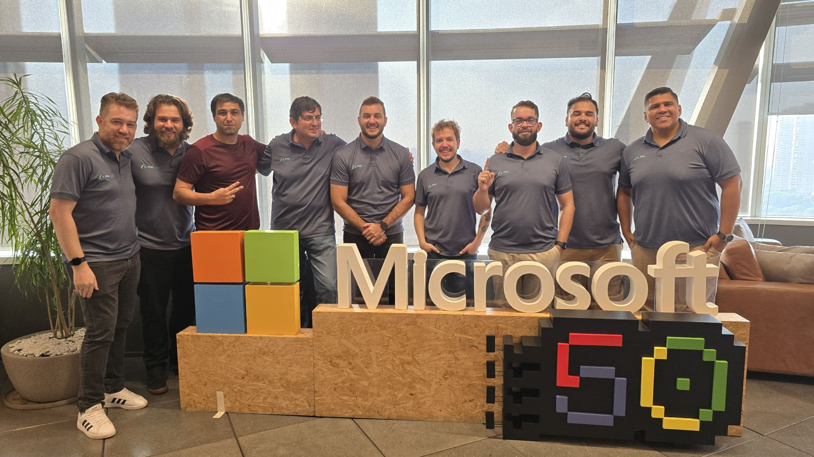
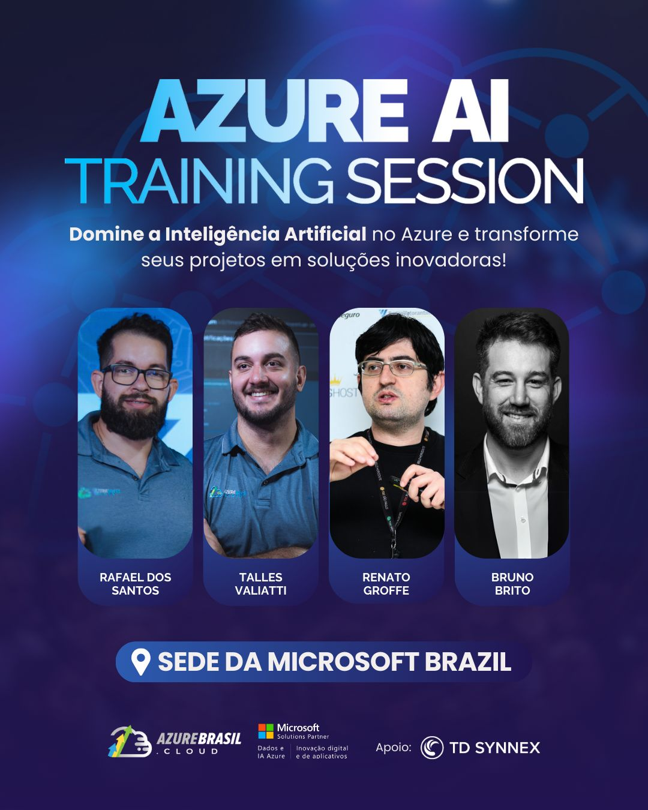
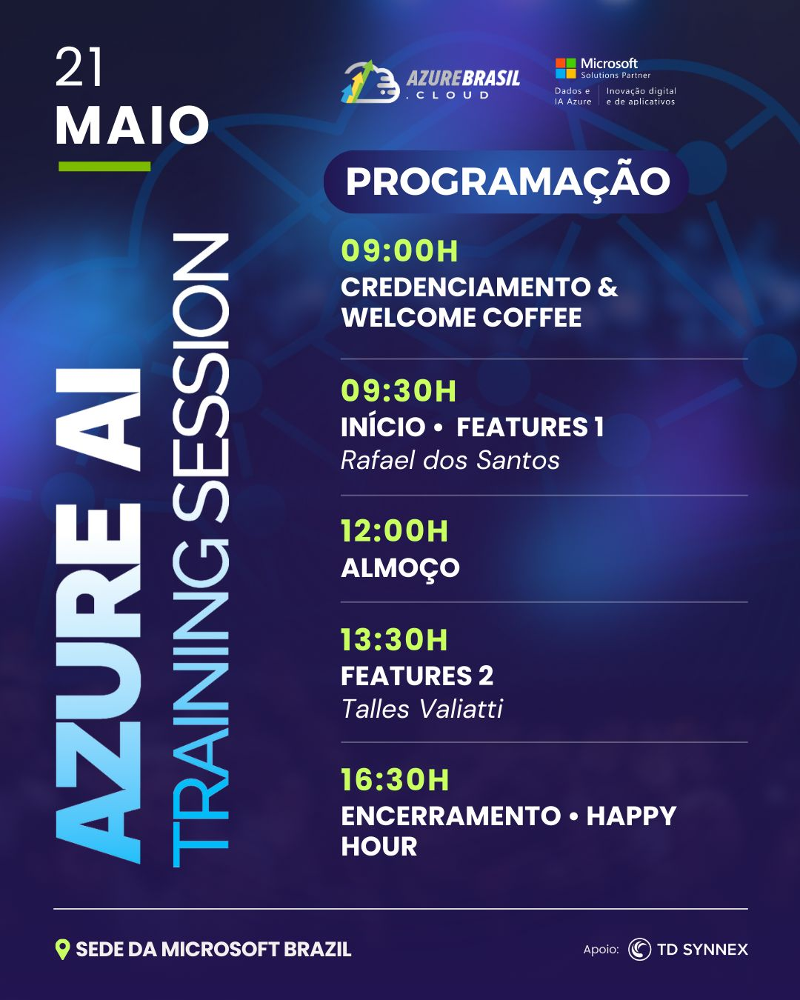

# azure-ai-training-session_2025-05
Conteúdos do Azure AI Training Session que aconteceu em 21/05/2025 na cidade de São Paulo-SP.

---

## Informações sobre o evento

Nome do treinamento: **Azure AI Training Session**

Data: **21/05/2025 (quarta-feira)**

Tecnologias e tópicos abordados: **Azure OpenAI, Azure AI Foundry, Azure AI Services, .NET, ASP.NET Core, C#, Aspire, Vue.js, OpenTelemetry, Application Insights, Docker, Docker Compose, Docker Model Runner, Ollama, Grafana, Jaeger, Zipkin, Elastic APM, OWASP Top 10 for LLMs...**

Número de participantes: **40 pessoas**

O Azure AI Training Session foi um evento presencial e gratuito promovido pela [**AzureBrasil.cloud**](https://www.azurebrasil.cloud/), acontecendo ao longo de 2025 em São Paulo-SP e outras cidades brasileiras.

Alguns links sobre o evento:
- https://www.linkedin.com/posts/azbr_azureai-comunidadetech-microsoftbrasil-activity-7334194380695572480-4sGP/
- https://www.linkedin.com/posts/azbr_azureai-microsoftbrasil-tdsynnex-activity-7331372209115914240-7XuD/
- https://www.linkedin.com/posts/azbr_azureai-microsoftbrasil-eventotech-activity-7330664519804891136-4WPi

Local: **Avenida Presidente Juscelino Kubitscheck, 1909 Torre Sul, 16° andar - Vila Nova Conceição - São Paulo - SP - CEP: 04543-907**

Acesse este [**link**](/img/) para visualizar todas as fotos da minha participação.

Além de auxiliar os participantes nas atividades práticas envolvendo o uso de IA no projeto de estudos, pude ainda realizar uma breve apresentação sobre a implementação de práticas de Observabilidade em aplicações que dependam de soluções de Inteligência Artificial via utilização do projeto OpenTelemetry.

Conteúdo sobre OpenTelemetry apresentado durante o evento: https://github.com/renatogroffe/opentelemetry-ias

Exemplo prático que serviu de base para o treinamento: https://github.com/AzureBrasil-cloud/ai-training-session-v2

Deixo aqui meus agradecimentos ao **Rafael Santos**, ao **Talles Valiatti**, ao **Otavio Naimeke**, ao **Bruno Brito**, ao **Carlos Machel**, ao **Luiz Carlos Assis**, ao **Erick Vendramel** e demais envolvidos pela oportunidade e todo o apoio.

---

